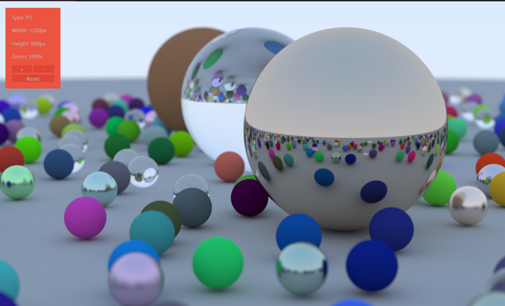

## ray tracing in rust

Reference: [Ray Tracing in One Weekend](https://raytracing.github.io/books/RayTracingInOneWeekend.html#thevec3class/vec3utilityfunctions)

## results:

final scene: 

## license

[mit](./LICENSE)
